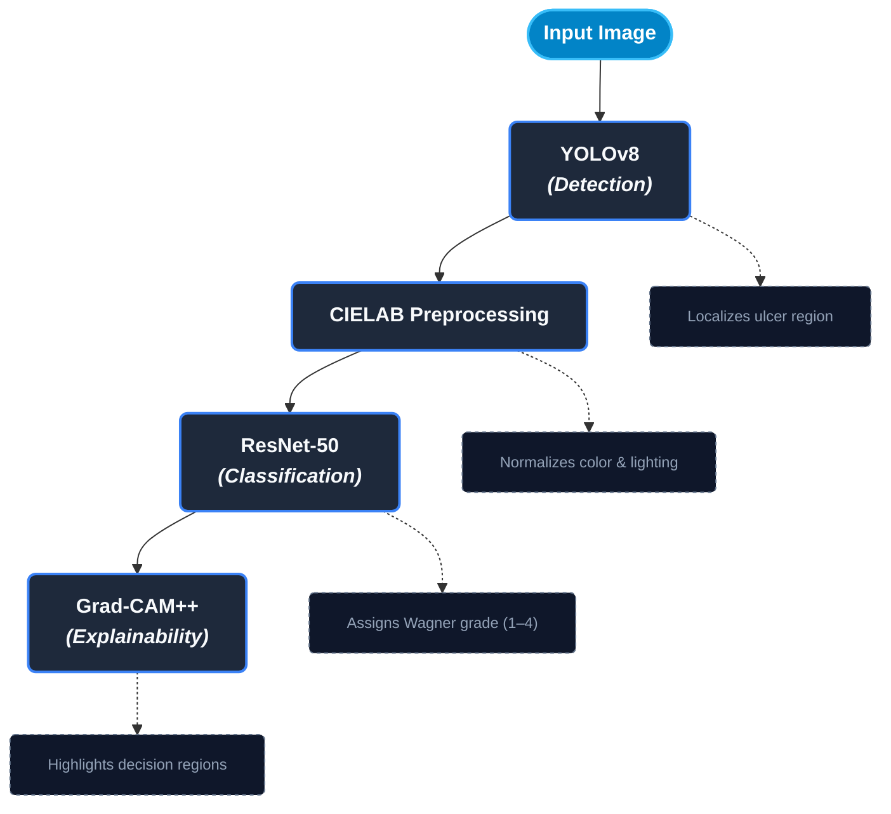

# AUTOMATED DETECTION AND GRADING OF DIABETIC FOOT ULCERS USING DEEP LEARNIING AND EXPLAINABLE AI

A two-stage deep learning pipeline that detects diabetic foot ulcers in images and classifies their severity using the Wagner grading scale — built with an explicit focus on reducing performance bias across skin tones, a gap in most clinical imaging models.

**Undergraduate Final Year Project — B.Sc. Computer Science, University of Lagos**

---

## 📓 View the Notebook

- **[View rendered notebook on nbviewer](https://nbviewer.org/github/bamiwoaluko/diabetic-foot-ulcer-detection-and-classification/blob/main/DFU_finalYearProject.ipynb)** — full notebook with all outputs, for a quick read-through
- **[Open in Google Colab](https://colab.research.google.com/drive/1P1HmrJgFHEoTaPfzcHhDbE7KVrY4LDrP?usp=sharing)** — run it yourself, cell by cell

---

## Overview

Diabetic foot ulcers (DFUs) are a serious complication of diabetes, and early, accurate severity grading is critical for treatment decisions. Most existing diagnostic imaging models are trained on datasets that skew toward certain skin tones, raising the risk of degraded performance for underrepresented groups. This project builds a full detection-and-classification pipeline while directly investigating and addressing that bias risk.

## Pipeline Architecture


## Key Features

- **Two-stage detection + classification** — YOLOv8 localizes the wound, ResNet50 grades it, rather than one model doing both jobs poorly
- **Bias mitigation via synthetic skin-tone augmentation** — CIELAB-based preprocessing plus synthetic skin-darkening augmentation, used to run a dedicated ablation study comparing model performance across skin tones
- **Explainability** — Grad-CAM++ visualizations show exactly what the model is looking at for each prediction
- **Interactive demo** — a Streamlit app wraps the full pipeline for hands-on use
- **Data integrity investigation** — mid-project, discovered and fixed a rotation-invariant duplicate-image leak across train/test splits (see below)

## Dataset

- **Detection (YOLOv8):** Roboflow foot ulcer dataset
- **Classification (ResNet50):** Combined Kaggle + SIKAD dataset — ~19,912 images across Wagner Grades 1–4

## The Data Integrity Investigation

Partway through the project, a check for exact-duplicate images turned into something bigger: **rotation- and flip-invariant near-duplicate images were leaking across the train and test splits**, meaning the model could have been "cheating" by memorizing rotated copies of training images rather than genuinely generalizing to new ones. This was investigated and fixed properly:

1. Built canonical, rotation-invariant perceptual hashes for every image in the dataset
2. Clustered near-duplicates together using a union-find approach
3. Rebuilt the train/valid/test split at the **cluster level** (so near-duplicates always land in the same split) using a stratified 70/15/15 ratio
4. Re-ran preprocessing and retrained both models on the corrected, leak-free dataset

The models and results in this repo reflect the **corrected**, leak-free pipeline.

## Bias Mitigation Methodology

- CIELAB color-space preprocessing standardizes lighting/color across images before classification
- Synthetic skin-darkening augmentation was applied to generate additional training examples across a wider range of skin tones
- Two versions of the classifier were trained — one with the augmentation, one without — to directly compare performance across skin tones and evaluate whether the augmentation genuinely helps (this was treated as a real investigative question, not assumed in advance)

## Results

### YOLOv8 (Detection) — evaluated at `conf=0.40`

| Metric | Score |
|---|---|
| mAP50 | 62.9% |
| Precision | 95.6% |
| Recall | 52.4% |

### ResNet50 (Classification) — Test Set

**Augmented Model**

| Wagner Grade | Precision | Recall | F1-Score | Support |
|---|---|---|---|---|
| Grade 1 | 0.95 | 0.97 | 0.96 | 687 |
| Grade 2 | 0.98 | 0.93 | 0.95 | 709 |
| Grade 3 | 0.95 | 0.98 | 0.97 | 807 |
| Grade 4 | 0.99 | 0.98 | 0.98 | 730 |
| **Accuracy** | | | **0.97** | 2,933 |
| Macro Avg | 0.99 | 0.97 | 0.97 | 2,933 |
| Weighted Avg | 0.97 | 0.97 | 0.97 | 2,933 |

**Non-Augmented Model**

| Wagner Grade | Precision | Recall | F1-Score | Support |
|---|---|---|---|---|
| Grade 1 | 0.97 | 0.97 | 0.97 | 687 |
| Grade 2 | 0.97 | 0.97 | 0.97 | 709 |
| Grade 3 | 0.97 | 0.99 | 0.98 | 807 |
| Grade 4 | 0.99 | 0.98 | 0.98 | 730 |
| **Accuracy** | | | **0.98** | 2,933 |
| Macro Avg | 0.98 | 0.98 | 0.98 | 2,933 |
| Weighted Avg | 0.98 | 0.98 | 0.98 | 2,933 |

**Why the non-augmented model scores slightly higher — and why that doesn't undercut the augmentation:**

On this leak-free test set, the non-augmented model achieved marginally higher overall accuracy (98%) than the augmented model (97%), with the gap most visible in Grade 2 (recall of 0.93 for the augmented model vs. 0.97 for the non-augmented model). This is a plausible outcome: synthetic skin-darkening augmentation increases the diversity of the training distribution, which can introduce a small amount of additional difficulty when the augmented model is evaluated on a standard test population that is not itself skin-tone-diverse. This result reinforces, rather than undermines, the necessity of the dedicated dark-skin ablation study: standard test-set accuracy alone does not capture the specific effect the augmentation was designed to produce, and may even show a mild trade-off against it. The augmentation's value, if any, has to be assessed on the population it targets, not the standard test distribution.

## Tech Stack

- **Languages/Frameworks:** Python, PyTorch
- **Models:** YOLOv8 (Ultralytics), ResNet50
- **Explainability:** Grad-CAM++
- **Deployment/Demo:** Streamlit
- **Tools:** Google Colab, Google Drive

## Project Structure
```text
project-root/
├── DFU_finalYearProject.ipynb   # Full pipeline: data prep, training, evaluation, Grad-CAM
├── app.py                       # Streamlit demo app
├── requirements.txt             # Dependencies for the Streamlit app
└── README.md                    # Project overview and setup guide
```


## Running the Streamlit App Locally

```bash
git clone https://github.com/bamiwoaluko/diabetic-foot-ulcer-detection-and-classification.git
cd diabetic-foot-ulcer-detection-and-classification
pip install -r requirements.txt
streamlit run app.py
```

## Limitations & Future Work

- Classification dataset size, while substantial (~19,912 images), is still limited relative to the full diversity of real-world presentations
- Synthetic skin-darkening augmentation approximates darker skin tones rather than using natively diverse real-world images — a larger, more diverse real dataset would strengthen the bias analysis further
- Live deployment of the Streamlit demo is in progress

## Author

**Oluwabamiwo Aluko**
[GitHub](https://github.com/bamiwoaluko) · [LinkedIn](https://www.linkedin.com/in/oluwabamiwo-aluko-b4618916b/)
